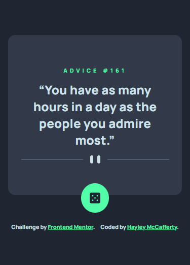

# Advice Generator App

Challenge from [Frontend Mentor](https://www.frontendmentor.io/)

## Usage

The purpose of this project was to practice HTML, CSS and JavaScript skills with
a design from Frontend Mentor challenge

## Challenge Description

"This is a nice, small project to practice handling user interactions and
updating the DOM. Perfect for anyone who has learned the basics of JavaScript!"

## Tech Stack

**Client:** HTML, CSS, JavaScript, React, FontAwesome

## Authors

- [@haylzrandom - GitHub](https://www.github.com/haylzrandom)
- [@haylzrandom - Frontend Mentor](https://www.frontendmentor.io/profile/HaylzRandom)

## Acknowledgements

- [Interactive Rating Component](https://www.frontendmentor.io/challenges/advice-generator-app-QdUG-13db)

## Related

Here are some related projects

- [Order Summary Component](https://github.com/HaylzRandom/order-summary-component)
- [QR Code Component](https://github.com/HaylzRandom/qr-code-component)
- [NFT Preview Card Component](https://github.com/HaylzRandom/nft-preview-card-component)
- [Stats Preview Component](https://github.com/HaylzRandom/stats-preview-card-component)
- [Interactive Rating Component](https://github.com/HaylzRandom/interactive-rating-component)
- [Calculator App with Theme Changer](https://github.com/HaylzRandom/calculator-app)

## Screenshots

Desktop Screenshot

Mobile Screenshot

